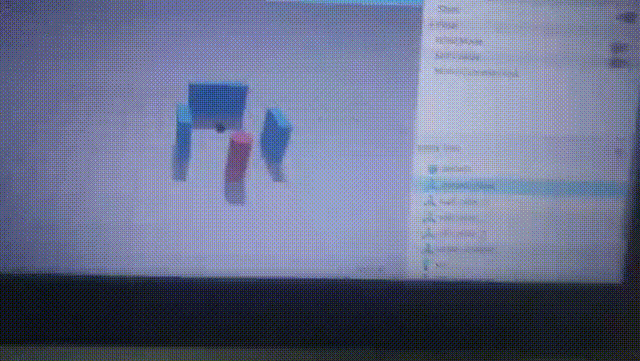

# my robot 

ros2 differential drive robot created usng URDF.

## Features 

-Differential drive wheels
-Lidar sensors
-Rviz visualization

# Tools Used

-ROS 2 jazzy
-URDF
-Rviz2

# Autonomous Mobile Robot (AMR) Navigation Stack

This project implements an autonomous navigation system for a custom differential-drive robot using **ROS 2 Jazzy Jalisco** and **Gazebo Sim**.

## Project Highlights
* **Autonomous Navigation**: Integrated the Nav2 stack for point-to-point path planning.
* **Real-time SLAM**: Utilized Async SLAM Toolbox for dynamic environment mapping.
* **Sensor Fusion**: Implemented EKF for robust odometry estimation.
* **Simulation**: High-fidelity physics simulation with Gazebo.

## Demo

## Getting Started
1. **Build**: `colcon build --symlink-install`
2. **Launch**: `ros2 launch my_robot sim.launch.py`
